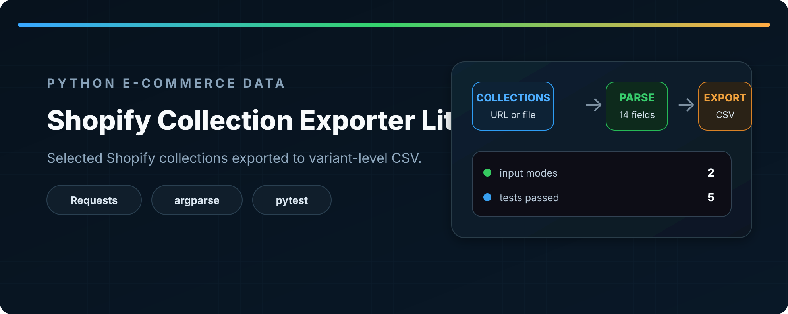
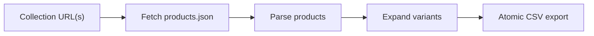

<div align="center">



# Shopify Collection Exporter Lite

**Export selected public Shopify collections to a variant-level CSV dataset.**

[](https://www.python.org/)
[](#tests)
[](#usage)

</div>

## Overview

Shopify Collection Exporter Lite is a small Python CLI for targeted product exports. It reads one collection URL—or a text file containing several collection URLs—loads the public Shopify `products.json` endpoint, expands product variants into individual rows, and writes the combined result to CSV.

This is useful when a full-store export is unnecessary and only selected categories such as sale items, shoes, jackets, or clearance products are needed.

## Workflow



## Features

| Area | Behavior |
|---|---|
| Sources | One collection URL or a text file with multiple collection URLs |
| Shopify data | Uses the public `/products.json` endpoint |
| Variants | Writes each product variant as a separate CSV row |
| Limits | Optional positive product limit applied per collection |
| Resilience | Handles HTTP, connection, timeout, and invalid JSON failures |
| Missing data | Uses safe empty values for unavailable handles, descriptions, images, and variant fields |
| Output safety | Creates parent directories and replaces the destination only after a temporary CSV is written |
| Verification | Five focused pytest checks cover parsing, failure handling, and storage |

## Tech Stack

| Tool | Purpose |
|---|---|
| Python | CLI and data-processing logic |
| Requests | HTTP and JSON retrieval |
| argparse | Command-line interface and input validation |
| csv | Structured export |
| pathlib | Output paths and atomic replacement |
| pytest | Automated tests |

## Project Structure

```text
shopify-collection-exporter-lite/
├── data/
│   └── collections.txt
├── src/
│   ├── fetcher.py
│   ├── main.py
│   ├── parser.py
│   ├── scraper.py
│   └── storage.py
├── tests/
│   ├── test_parser.py
│   ├── test_scraper.py
│   └── test_storage.py
├── requirements.txt
├── requirements-dev.txt
└── README.md
```

## Installation

Clone the repository and install the runtime dependency:

```bash
git clone https://github.com/Mr-sanabi/shopify-collection-exporter-lite.git
cd shopify-collection-exporter-lite
python -m pip install -r requirements.txt
```

For development and tests:

```bash
python -m pip install -r requirements-dev.txt
```

## Usage

The output CSV path is positional. Exactly one source option is required.

### Export one collection

```bash
python src/main.py data/products.csv \
  --collection-url "https://store.example/collections/running-shoes"
```

Apply a product limit:

```bash
python src/main.py data/products.csv \
  --collection-url "https://store.example/collections/running-shoes" \
  --limit 25
```

### Export several collections

Create a UTF-8 text file containing one collection URL per line:

```text
https://store.example/collections/running-shoes
https://store.example/collections/jackets
```

Then run:

```bash
python src/main.py data/products.csv \
  --collections-file data/collections.txt \
  --limit 25
```

`--limit` counts products per collection, not output rows. A product with multiple variants creates multiple rows.

### CLI reference

```text
python src/main.py OUTPUT_FILE
  (--collection-url URL | --collections-file FILE)
  [--limit POSITIVE_INTEGER]
```

| Argument | Description |
|---|---|
| `output_file` | Destination CSV path |
| `--collection-url` | One Shopify collection URL |
| `--collections-file` | Text file with one collection URL per line |
| `--limit` | Optional positive product limit per collection |

## CSV Schema

| Column | Description |
|---|---|
| `product_title` | Product name |
| `product_url` | Store product URL built from the product handle |
| `description` | Shopify `body_html`, with `description` as fallback |
| `price` | Variant price |
| `compare_at_price` | Variant comparison price, when available |
| `variant_title` | Variant name |
| `option1` | First variant option |
| `option2` | Second variant option |
| `option3` | Third variant option |
| `sku` | Variant SKU |
| `image_url` | First product image URL |
| `availability` | Variant availability value |
| `source_collection` | Collection URL that produced the row |
| `scraped_at` | Local ISO-formatted extraction timestamp |

## Example Output

```csv
product_title,product_url,description,price,compare_at_price,variant_title,option1,option2,option3,sku,image_url,availability,source_collection,scraped_at
Trail Runner,https://store.example/products/trail-runner,<p>Trail shoe.</p>,79.99,,Size 42,42,,,TRAIL-42,https://cdn.example/trail.jpg,True,https://store.example/collections/running-shoes,2026-07-17T10:30:00
```

## Tests

Run the complete suite from the repository root:

```bash
python -m pytest -q
```

Current coverage focuses on:

- parsing a collection response without a limit;
- safe handling of products without a handle;
- description priority and fallback behavior;
- returning an empty result when fetching fails;
- creating nested output directories and writing a readable CSV.

## Reliability Notes

CSV output is written to a temporary sibling file first and then moved over the destination. If the write fails before replacement, the existing destination file is not partially overwritten.

Network requests use a 10-second timeout and `raise_for_status()`. Fetch failures and invalid JSON responses return no records for that collection instead of crashing the full multi-collection run.

## Limitations

- Only public Shopify collection JSON endpoints are supported.
- Stores may disable, restrict, or customize access to `products.json`.
- The exporter performs one endpoint request per collection and does not implement Shopify pagination.
- Overlapping collections are not deduplicated.
- Only the first product image is exported.
- The output is a general analysis CSV, not Shopify's official import template.
- The tool does not bypass authentication, CAPTCHAs, rate limits, or anti-bot systems.

## Responsible Use

Use the exporter only with publicly accessible data and where automated access is permitted. Respect site terms, robots policies, rate limits, and applicable data-use rules.
